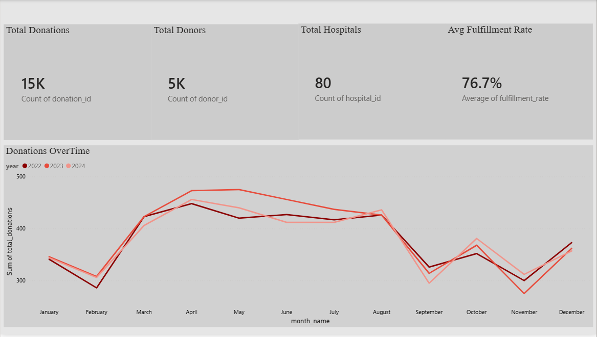
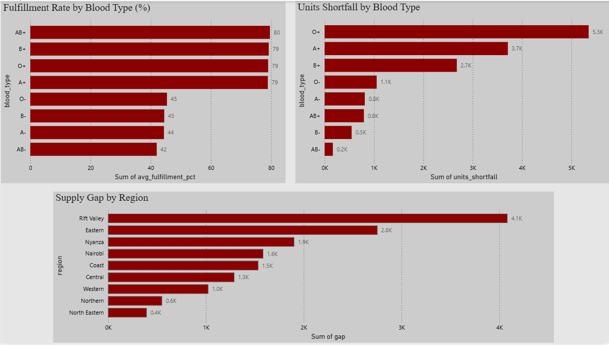
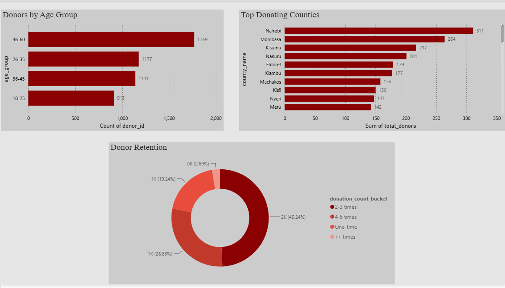
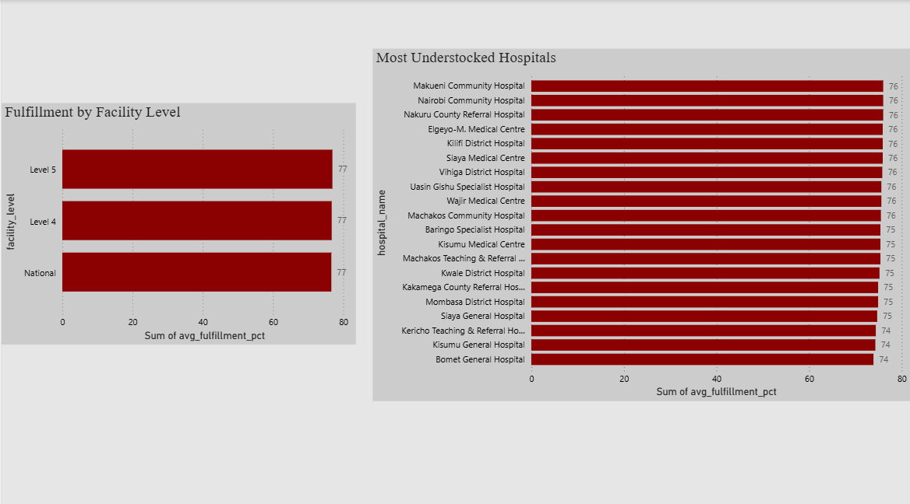
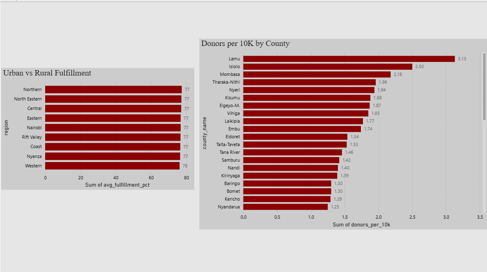

# blood-donation-analytics
# Kenya Blood Donation Analytics Platform

An end-to-end data engineering project that simulates a national blood donation database for Kenya. It covers synthetic data generation, a PostgreSQL data warehouse built on a star schema, a full ETL pipeline, SQL analytics, and a five-page Power BI dashboard.

This project sits alongside [HemaMatch](https://github.com/elmbondo/hemamatch), a blood donor-recipient matching system with an ARIMA-based inventory forecasting module. Together they form a complete data ecosystem around one real problem: blood supply management in Kenya.

---

## What is in this repo

```
blood-donation-analytics/
├── data/
│   └── raw/                       # Five generated CSV files
├── screenshots/                   # Power BI dashboard screenshots
├── generate_data.py               # Phase 1: synthetic data generation
├── etl.py                         # Phase 3: ETL pipeline
├── analytics.sql                  # Phase 4: SQL views and queries
└── blood_donation_analytics.pbix  # Phase 5: Power BI dashboard

```

---

## Tech Stack

- Python, Pandas, NumPy, Faker: data generation and ETL
- PostgreSQL 17: star schema data warehouse
- pgAdmin 4: database management
- SQLAlchemy and psycopg2: Python to PostgreSQL connection
- Power BI Desktop: dashboard and reporting

---

## How to reproduce this project

**Step 1: Install dependencies**

```bash
pip install pandas numpy faker sqlalchemy psycopg2-binary
```

You will also need PostgreSQL 17 and Power BI Desktop installed locally.

**Step 2: Generate the data**

```bash
python generate_data.py
```

This creates five CSV files in `data/raw/` covering counties, hospitals, donors, donations, and blood requests. The data covers three years from 2022 to 2024 and follows realistic Kenyan patterns including blood type prevalence, seasonal donation spikes, and urban versus rural demand differences.

**Step 3: Set up the database**

Create a PostgreSQL database called `blood_donation_analytics`. Open pgAdmin, paste the schema from `analytics.sql` into the Query Tool, and run it. This creates the star schema with two fact tables and five dimension tables.

**Step 4: Run the ETL pipeline**

Update the database password in `etl.py`, then run:

```bash
python etl.py
```

This extracts data from the CSVs, transforms it into star schema format, and loads it into PostgreSQL. The final output confirms row counts across all seven tables.

**Step 5: Run the SQL analytics**

Open `analytics.sql` in pgAdmin and run the full script. It creates ten analytical views covering blood type shortages, donor retention, hospital performance, regional gaps, and seasonal demand patterns.

**Step 6: Open the dashboard**

Open `blood_donation_analytics.pbix` in Power BI Desktop. Connect to your local PostgreSQL instance when prompted.

---

## Data Model

The warehouse uses a star schema with two fact tables at the centre.

**Fact tables**
- `fact_donations`: one row per donation event
- `fact_blood_requests`: one row per hospital blood request

**Dimension tables**
- `dim_donors`: age group, gender, blood type, county, registration year
- `dim_hospitals`: name, county, region, facility level
- `dim_blood_types`: rarity category, universal donor and recipient flags
- `dim_counties`: region, population, urban or rural classification
- `dim_time`: date, month, quarter, year, season, public holiday flag

---

## Dashboard

The Power BI dashboard has five pages.

**Page 1: Overview**
High-level KPIs: 15,000 donations, 5,000 donors, 80 hospitals, 76.7% average fulfillment rate. A line chart shows monthly donation trends across all three years, with a consistent peak in March and April and a dip in August.




**Page 2: Blood Supply Analysis**
Fulfillment rates and unit shortfalls by blood type, plus supply gaps by region. Rift Valley carries the largest regional burden.





**Page 3: Donor Analytics**
Donor demographics by age group, top donating counties, and retention breakdown. Nearly half of registered donors donate only once.





**Page 4: Hospital Performance**
Fulfillment rates by individual hospital and by facility level. Bomet General Hospital is the most supply-constrained in the dataset.





**Page 5: County Intelligence**
Donor density per 10,000 people across all 47 counties, and fulfillment rates by region.




---

## Key Findings

Three findings stood out during analysis.

**O+ is the real crisis blood type, not AB-.** AB- has the lowest fulfillment rate at 42%, but O+ has the largest absolute shortfall by a significant margin. Because O+ accounts for 40% of all blood requests, even a modest fulfillment gap adds up to thousands of unmet units. AB- is rare enough that low volume limits the scale of the problem.

**National hospitals are more supply-constrained than Level 4 hospitals.** The assumption going in was that higher-tier facilities would be better stocked. The data shows the opposite: National hospitals average 76.6% fulfillment versus 76.7% for Level 4. This suggests the problem is systemic rather than tier-specific, and that demand at National hospitals outpaces any supply advantages they might have.

**Lamu has the highest donor density in Kenya.** With 3.13 donors per 10,000 people, Lamu outperforms Nairobi, Mombasa, and every other county in the dataset. For a small coastal county this is unexpected, and it points to the value of community-level donation culture over sheer population size.

---

## Why I built this

This project grew out of HemaMatch, a capstone project I built with my team at JKUAT. HemaMatch handles the matching side of blood donation: connecting donors to recipients in real time. But while building it, I kept thinking about the upstream problem. Before you can match anyone, you need to understand where blood is, where it is not, and why. This project is my attempt to answer that question at a national scale using real data engineering tools.

The Kenya-specific context matters to me. Blood type distributions, county populations, facility levels, seasonal trauma patterns tied to the Long Rains: all of these are modelled on real Kenyan data. The goal was to build something that could, with real data plugged in, actually be useful to the Kenya National Blood Transfusion Service.

---

## Author

Fidelmah Nthambi Mbondo
BSc Mathematics and Computer Science, JKUAT
[GitHub](https://github.com/elmbondo) | Nairobi, Kenya
```
